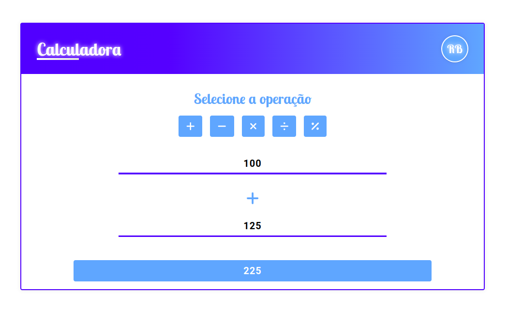

# Calculadora Vue.js
Esta é uma calculadora em formato de formulário desenvolvida com Vue.js e Javascript, permitindo realizar operações básicas como soma, subtração, multiplicação e divisão. O projeto utiliza CSS3 para estilização. Ícones interativos foram implementados com as bibliotecas do fontawesome disponivéis para Vue. O projeto é estruturado utilizando o Vite como bundler, garantindo uma build rápida e eficiente.
 
 

## Tecnologias Utilizadas

&nbsp;
&nbsp;
&nbsp;
&nbsp;
&nbsp;

 
 

## Link Demo: [Calculadora Vue](https://calculadora-vue-beta.vercel.app/)

  

